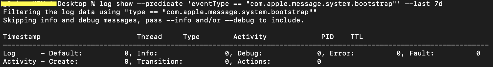
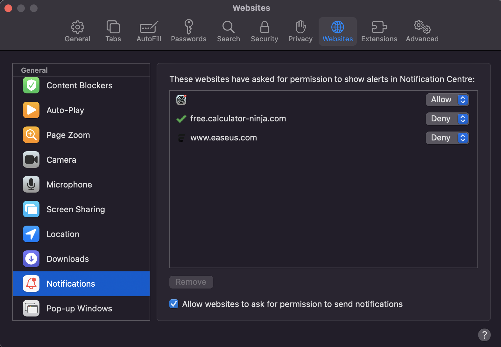
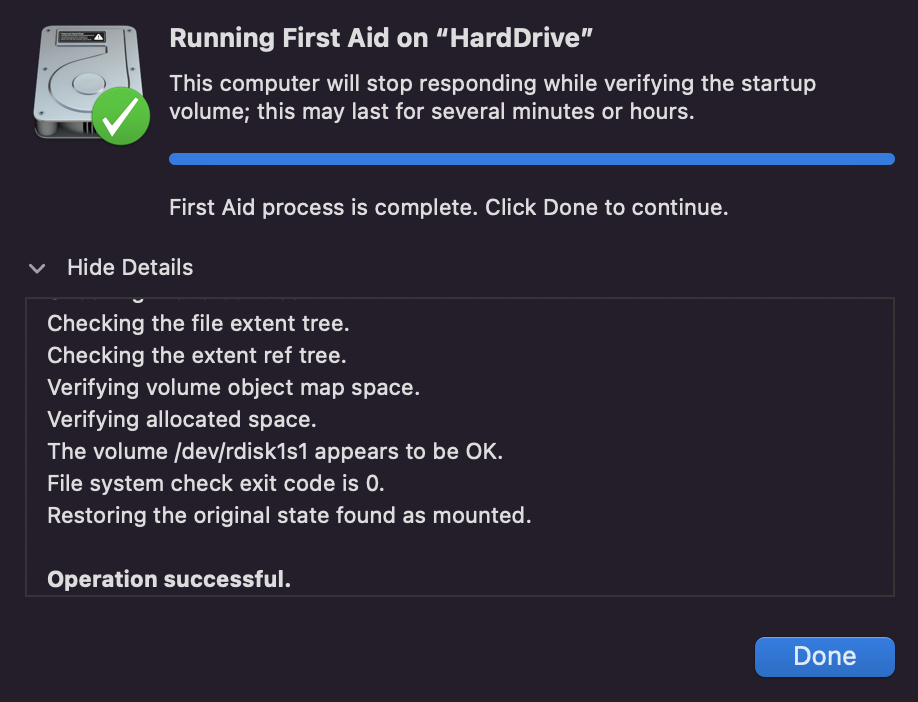

# Removing Adware and Fake Notifications on macOS Monterey

This guide documents the step-by-step process I followed to help a friend clean adware off their MacBook running macOS Monterey.  
They were receiving fake alert notifications in Safari and experiencing random shutdowns.  
Since I couldn’t access Safari settings in the original user account, I used a workaround and performed the cleanup through a new user account.

> **⚠️ Note:** Before deleting any files or killing processes, always double-check their legitimacy.  
> Misidentifying a system process can cause unexpected issues. When in doubt, use tools like [VirusTotal](https://www.virustotal.com/) or search online for clarification.

---

## ✅ Step 1 – Check for Suspicious Startup Items

Before running any tools, I manually checked for signs of malware by inspecting Launch Agents and Daemons—common hiding spots for persistent malware.

### 📂 Accessing the Library

1. Open `Finder > Go > Home`
2. Click `Go` again, then hold the **Option** key and select `Library`
3. Navigate through these folders and inspect contents:

- `~/Library/LaunchAgents/`
- `/Library/LaunchDaemons/`
- `/Library/StartupItems/` *(obsolete, but worth checking if present)*

> 🕵️ Look for unfamiliar app names, randomized filenames, or recently modified files.  
> If anything looks suspicious, do some research before deleting.

### 🚩 Known Suspicious Files or Common Adware Names

Some file names may vary slightly or be randomized. Watch out for names like:

- `com.pcv.hlpramc.plist`
- `com.adobe.fpsaud.plist` *(fake version, not legit Flash)*
- `com.mcp.agent.plist`
- `com.avickUpd.plist`
- `com.myppes.download.plist`
- `maccleaner.pkg` *(or any “cleaner” tool you didn’t install)*
- `com.3gXJ4sd2.random.plist` *(random strings like this)*

> 📌 Tip: If in doubt, copy the file name and Google it, or upload to [VirusTotal](https://www.virustotal.com/).

---

## ✅ Step 2 – Use Activity Monitor to Spot Suspicious Processes

Activity Monitor gives a live overview of what’s running on the system—essential for identifying rogue processes tied to adware or unnecessary background tasks.

### 🧭 Open Activity Monitor

1. Press `Cmd + Space` to open Spotlight  
2. Type `Activity Monitor` and hit Enter

### 📊 Sort by Resource Usage

- Go to the **CPU** tab → Sort by `% CPU`
- Go to the **Memory** tab → Look for anything with high memory usage

> 👀 Take note of processes with strange names or anything using a lot of resources for no clear reason.

### 🧪 Inspect Unfamiliar Processes

- Right-click the process → `Inspect` or `Sample Process`
- Google suspicious names or scan on [VirusTotal](https://www.virustotal.com/)

> ❗ **Don't kill random processes blindly.** Use VirusTotal for analysis and verification—especially when combined with findings from the next steps.

---

## ✅ Step 3 – Identify Fake Notifications and Browser Hijacking

Once connected to the internet, the user was receiving fake system notifications.

> 💡 Many of these pop-ups are from websites granted notification access—not from macOS itself.

### 🔎 What to Look For

- Spelling mistakes and weird grammar in the notifications  
- Notifications only appear while online  
- Behavior consistent with adware exploiting browser notification permissions


---

## ✅ Step 4 – Check System Logs via Terminal

To investigate the source of the notifications, I checked the logs for any unusual system behavior.

### 📂 Open Terminal and Filter Logs

1. Open **Terminal**.
2. Run the following command to filter logs related to system bootstrapping:
   ```bash
   log show --predicate 'eventType == "com.apple.message.system.bootstrap"' --last 7d



### 🔎 What to Look For
Unusual system processes, errors, or any suspicious app/process names during the period of fake notifications.

---

## ✅ Step 5 – Create a New User Account

Since Safari settings weren’t accessible in the original account, I created a new one to bypass the restriction.

### 📂 Create a New User Account

1. Go to **System Preferences > Users & Groups**.
2. Click the **lock** to make changes.
3. Add a **Standard** or **Admin** account.
4. Log into the new account to continue the cleanup safely.

> 🕵️ **Why Create a New User Account:**  
New User Account bypasses corrupted permissions/extensions in the infected profile.  
After cleanup, you can delete the temporary user account.  
Performing cleanup from a clean user profile helps avoid interference from active adware processes.

---

## ✅ Step 6 – Clean Up Safari

The next step was to clean up Safari and remove any traces of the suspicious behavior.

### 🚫 Remove Suspicious Notification Permissions

1. Open **Safari** > **Preferences** > **Websites** > **Notifications**.
2. Remove any unfamiliar or sketchy websites (in this case, I found 3).



### 🧹 Clear Website Data

1. Go to **Safari** > **Preferences** > **Privacy** > **Manage Website Data**.
2. Click **Remove All** to delete stored cookies and cache.

### 🔌 Check Safari Extensions

1. Go to **Safari** > **Preferences** > **Extensions**.
2. Disable or uninstall any unknown or untrusted extensions.

---

## ✅ Step 7 – Check System Settings

Make sure nothing is hiding in Notifications or Login Items:

### 📂 Check Notifications & Focus

1. Go to **System Preferences** > **Notifications & Focus**.
2. Review each app and look for unknown entries.

> 🕵️ **What to Look For:**  
In this case, I found the following to be suspicious:
- **Confirm that you are not a robot** (fake banner)
- **www.easeus.com**
  


### 📋 Check Login Items

1. Go to **System Preferences** > **Users & Groups** > **Login Items**.
2. Remove any suspicious login items.


> 📝 **Important:**  
Recheck these after malware scans in case anything respawns.

---

## ✅ Step 8 – Run Malware Scan

After manual cleanup, I recommended running a reputable malware removal tool:

### 🔍 Recommended Tools:

- **Malwarebytes for Mac**
- **AdwareMedic** (now bundled into Malwarebytes)

> ⚠️ **Why Run a Malware Scan:**  
These tools help find and remove leftover adware that might be deeper in the system.

---

## ✅ Step 9 – Run Disk Utility

To ensure there’s no file system damage from the sudden shutdowns:

### 📂 Open Disk Utility

1. Open **Disk Utility** via Spotlight.
2. Select **Macintosh HD** and click **First Aid** > **Run**.
3. Repeat this for any containers or sub-volumes under the main drive.

> 🛠️ **Why Use Disk Utility:**  
This is a non-destructive repair tool, so it’s safe to run and highly recommended after malware issues.



---

## ✅ Step 10 – Run Apple Diagnostics

The user mentioned random shutdowns and a strange screen before the system would freeze. To rule out hardware issues:

### 🧑‍🔧 Run Apple Diagnostics

1. Shut down the Mac.
2. Turn it on and immediately press and hold the **D** key.
3. Wait for **Apple Diagnostics** to launch.
4. Run the test and note any reference codes (e.g., memory or logic board issues).

> ⚡ **Why Run Apple Diagnostics:**  
This test checks for RAM, logic board, SSD, and more. It’s a key step when dealing with unexplained shutdowns.

---

## ✅ Final Checklist

- Launch Agents/Daemons cleaned
- Safari Notification permissions removed
- Safari Website Data cleared
- Extensions reviewed
- Malware scan completed
- Login Items reviewed
- Notifications & Focus settings checked
- Disk Utility First Aid run
- Apple Diagnostics completed

---

## ✅ Bonus Tip – Stay Safe Going Forward

To prevent reinfection and stay protected:

- Avoid clicking pop-ups that claim your Mac is infected or needs urgent attention.
- Don’t install “cleaning” apps unless you’ve researched and trust them.
- Keep your macOS and browsers updated to patch known security issues.
- Review notification permissions regularly in Safari and other browsers.
- Use an ad-blocker to reduce exposure to malicious ads and fake alerts.
- Be cautious when downloading apps and always use the official App Store or verified developer websites.

> 💡 **Important:**  
This guide is based on real troubleshooting steps and can serve as a practical reference for helping others facing similar issues on macOS Monterey.

---

## 📜 Credits

Guide by **Nicolas Cordischi**
